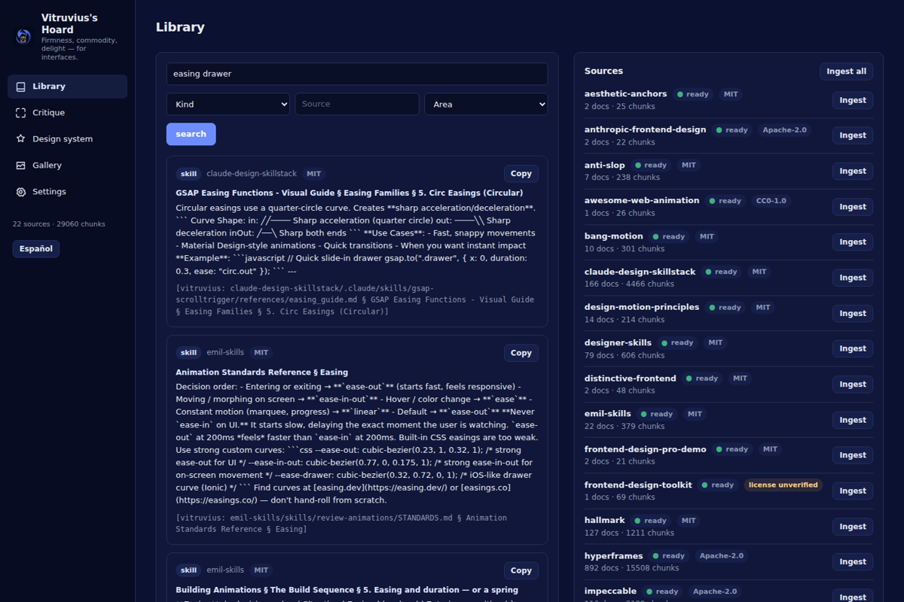
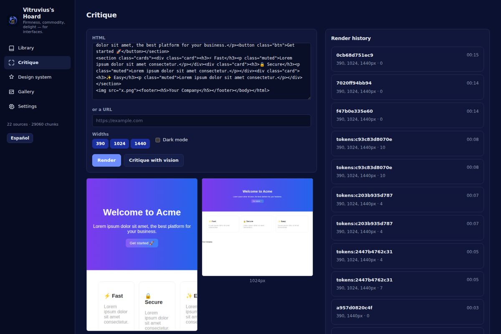
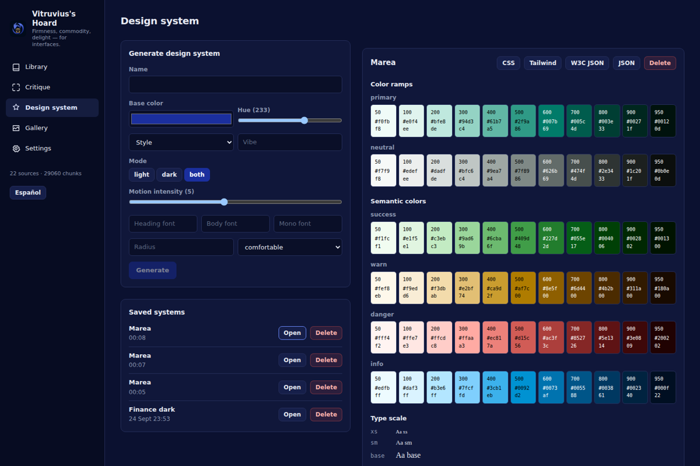
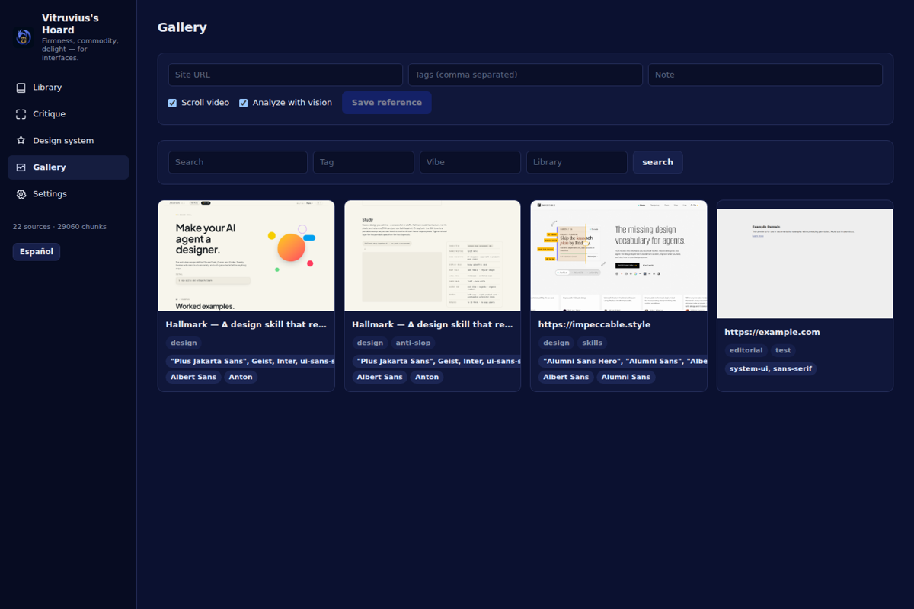

# Vitruvius's Hoard

*Firmness, commodity, delight — for interfaces.*

A local frontend-design workbench for the assistant (the Faustus workspace) and for the person using it: the
"design sense" a raw code model lacks. Four cores, one app:

- a **library of criterion** ingested from open design-skill repositories (rules, styles, palettes, font
  pairings, motion recipes), searchable with citations;
- a **render → capture → critique loop** on real Chromium: render HTML or a URL, screenshot it at several
  widths, run 29 deterministic design-lint checks, and (optionally) get a vision-model critique;
- a **design-system generator**: pure-Python OKLCH colour ramps, a fluid type scale, spacing/radius/shadow/motion
  tokens, exported as CSS variables, a Tailwind v4 theme, W3C design tokens JSON and a flat JSON, plus a live,
  self-contained playground page;
- a **reference gallery**: capture a website's desktop and mobile screenshots, a scroll video, its fonts,
  palette and animation libraries, and search them later by tag, vibe or library.

Everything above is exposed both as a small REST API (for its own UI) and as 25 MCP tools (for the assistant),
built from the *same* code, so they can never disagree.

## Why

Code models are fluent in code but default to the same handful of generic-looking pages: Inter on white, a
purple-to-blue gradient button, a hero section followed by three feature cards. Vitruvius's Hoard gives an
assistant somewhere to look up real design criteria (with a citation, not a guess), a way to actually *see* what
it built (render + screenshot, not just markup) and a deterministic way to flag the tell-tale generic patterns
before a person ever has to say "this looks AI-generated."

## Features

- **Library**: full-text search (SQLite FTS5, `bm25` ranking) over ingested skill repositories, with an optional
  vector rerank once embeddings exist. Every hit carries a `[vitruvius: source/path § heading]` citation.
- **Design briefs**: a deterministic composition of 2-3 matching styles, one palette, one font pairing, rules by
  area and a pre-delivery checklist — all cited, with an optional 150-word art-direction paragraph from a local
  model.
- **Render & capture**: a single background Chromium worker (Playwright), screenshots at any widths, an optional
  6-second scroll-and-back video (converted to MP4 with ffmpeg when it's on `PATH`), and a rich in-page probe
  (fonts, computed colours, headings, contrast pairs, tap-target sizes, animation counts, external libraries).
- **Design lint**: 29 deterministic checks (fonts, contrast, layout, motion, accessibility, content, performance,
  and several "generic AI palette" detectors) with a stable id, severity, evidence and a concrete fix per finding.
- **Critique**: lint findings merged with an optional vision-model rubric (hierarchy, typography, colour, spacing,
  motion, distinctiveness, accessibility, copy), scored 0-10.
- **Design tokens**: OKLCH ramps (50-950), semantic colours, light/dark surfaces, a fluid type scale, spacing,
  radius, shadows and motion tokens (durations, easings, a motion-intensity knob), exported four ways.
- **Reference gallery**: capture any URL or raw HTML, extract its palette (Pillow quantization), detected
  animation libraries and motion characteristics, and search the gallery later.
- **MCP + REST**: 25 tools behind one token-guarded bridge, plus the identical REST routes the bundled UI uses
  (see `docs/API.md`).

## Install

### Requirements

- Python 3.11+ (Windows target: 3.13)
- Node.js 22+ (only to build the client)
- `git` on `PATH` (for ingesting sources)
- `ffmpeg` on `PATH` (optional, for MP4 scroll videos — WebM is kept otherwise)
- A Chromium build reachable by Playwright: run `python -m playwright install chromium` once, or have Edge/Chrome
  installed (the render worker falls back to `channel="msedge"` / `channel="chrome"`)

### Linux / macOS

```bash
python3 -m venv venv
source venv/bin/activate
pip install -r requirements.txt
python -m playwright install chromium
npm install
npm run build
python -m vitruvius_hoard
```

### Windows

```powershell
py -3.13 -m venv venv
venv\Scripts\activate
pip install -r requirements.txt
python -m playwright install chromium
npm install
npm run build
python -m vitruvius_hoard
```

The app writes its data to `data/` next to this repository (override with `VITRUVIUS_DATA_DIR`), picks a free
port starting at `5191` (override with `VITRUVIUS_PORT`, or set `PORT_STRICT=1` to require exactly that port),
and writes `data/mcp-token` and `data/url` on start.

## MCP setup

Point your MCP-capable assistant at `mcp_server.py` with the same Python interpreter used above. The bundled
`faustus-plugin.json` is the manifest the Faustus workspace reads to wire it up automatically (id `vitruvius`,
health check at `/api/health`, stdio MCP bridge). For a manual `mcp.json` entry:

```json
{
  "mcpServers": {
    "vitruvius-hoard": {
      "command": "/path/to/venv/bin/python",
      "args": ["/path/to/vitruvius/mcp_server.py"],
      "env": { "VITRUVIUS_URL": "http://127.0.0.1:5191" }
    }
  }
}
```

The bridge never opens the database itself: it proxies every call to `POST /api/agent/call` on the running app
(starting it automatically if it isn't already running) using the bearer token in `data/mcp-token`.

## Tools

| Tool | Read-only | What it does |
| --- | --- | --- |
| `design_search` | yes | Search the design library: rules, skills, styles, motion recipes with citations. |
| `design_brief` | yes | Design brief for a page/app: style, palette, fonts, rules, motion, anti-patterns. |
| `design_rules` | yes | List design rules by area (typography, color, layout, motion, a11y, forms). |
| `styles_search` | yes | Find UI styles (glass, brutalist, swiss, aurora…) with tokens and when to use them. |
| `palettes_search` | yes | Find catalogued colour palettes by name or product type. |
| `fonts_search` | yes | Find catalogued font pairings by mood or query. |
| `render_preview` | no | Render HTML or a URL in Chromium, screenshot at widths, run lint. |
| `design_lint` | yes | Deterministic design checks on HTML/URL (fonts, contrast, motion, a11y, generic-AI patterns). |
| `design_critique` | no | Critique a rendered page: score 0-10, findings with fixes, using lint + local vision model. |
| `page_assay` | yes | Functional check of a generated page in a real browser: does every control work? Runs [assay](https://github.com/awss1i/assay) (`pip install assay-ui`) — no tests written, no model. |
| `render_compare` | yes | Pixel-diff two renders at a given width: percent changed + a diff image. |
| `tokens_generate` | no | Generate a design system: OKLCH palettes, type scale, spacing, motion tokens. |
| `tokens_get` | yes | Get a generated design system in json, css, tailwind or w3c format. |
| `tokens_list` | yes | List generated design systems. |
| `tokens_preview` | no | Render the design system's live playground and lint it. |
| `tokens_delete` | no (destructive) | Delete a generated design system (only when the user asks). |
| `reference_add` | no | Capture a website into the reference gallery: screenshots, video, fonts, palette. |
| `reference_search` | yes | Search the reference gallery by text, tags, vibe or library. |
| `reference_get` | yes | Get one reference's full detail (files, palette, fonts, motion, analysis). |
| `reference_delete` | no (destructive) | Delete a reference from the gallery (only when the user asks). |
| `sources_list` | yes | List every ingested design-criterion source and its status. |
| `source_add` | no | Add a new source to ingest: a git repo, a local folder or a single page URL. |
| `source_ingest` | no | Ingest (or re-ingest) one source or every source; runs in the background. |
| `source_status` | yes | Status of one source's ingest (idle, cloning, ingesting, ready, error). |
| `vitruvius_status` | yes | Health: browser, ffmpeg, git, library counts, model resolution for vision/chat/embeddings. |

The assistant is told, in `AGENT_INSTRUCTIONS`, to cite the library with `[vitruvius: ...]`, to iterate with
`render_preview` → `design_critique` → fix → render again (stopping at score ≥ 8 or after 3 rounds), and to only
call the writing tools (`reference_add`, `source_add`, `source_ingest`, `tokens_delete`, `reference_delete`) when
the user actually asks for that.

## Sources it ships with

`vitruvius_hoard/seeds.json` lists the repositories the library ingests on first run (`Ingest all` in the UI or
`python scripts/ingest.py --all`). Each one is cloned shallowly into `data/sources/<id>`; only Markdown/CSV/JSON
under the listed paths is indexed, and every search hit cites its source. All credit for the criteria belongs to
their authors — this app only indexes them locally. Add your own with `source_add` (a git URL or a local folder).

| id | repository | licence | category |
|---|---|---|---|
| `impeccable` | [pbakaus/impeccable](https://github.com/pbakaus/impeccable) | Apache-2.0 | criterion |
| `anti-slop` | [miqdadbadjuber/anti-slop](https://github.com/miqdadbadjuber/anti-slop) | MIT | rules |
| `hallmark` | [Nutlope/hallmark](https://github.com/Nutlope/hallmark) | MIT | criterion |
| `superdesign-skill` | [superdesigndev/superdesign-skill](https://github.com/superdesigndev/superdesign-skill) | MIT | criterion |
| `anthropic-frontend-design` | [anthropics/skills](https://github.com/anthropics/skills) | Apache-2.0 | criterion |
| `vercel-web-interface-guidelines` | [vercel-labs/web-interface-guidelines](https://github.com/vercel-labs/web-interface-guidelines) | MIT | rules |
| `ui-ux-pro-max` | [nextlevelbuilder/ui-ux-pro-max-skill](https://github.com/nextlevelbuilder/ui-ux-pro-max-skill) | MIT | catalog |
| `taste-skill` | [Leonxlnx/taste-skill](https://github.com/Leonxlnx/taste-skill) | MIT | criterion |
| `aesthetic-anchors` | [Ilm-Alan/frontend-design](https://github.com/Ilm-Alan/frontend-design) | MIT | criterion |
| `frontend-design-pro-demo` | [claudekit/frontend-design-pro-demo](https://github.com/claudekit/frontend-design-pro-demo) | MIT | reference |
| `distinctive-frontend` | [Koomook/claude-frontend-skills](https://github.com/Koomook/claude-frontend-skills) | MIT | criterion |
| `design-motion-principles` | [kylezantos/design-motion-principles](https://github.com/kylezantos/design-motion-principles) | MIT | motion |
| `emil-skills` | [emilkowalski/skills](https://github.com/emilkowalski/skills) | MIT | motion |
| `claude-design-skillstack` | [freshtechbro/claudedesignskills](https://github.com/freshtechbro/claudedesignskills) | MIT | motion |
| `bang-motion` | [bangtutorial/bang-motion](https://github.com/bangtutorial/bang-motion) | MIT | motion |
| `hyperframes` | [heygen-com/hyperframes](https://github.com/heygen-com/hyperframes) | Apache-2.0 | motion |
| `nullmotion` | [blixvip/NullMotion](https://github.com/blixvip/NullMotion) | not stated (flagged in the UI) | motion |
| `web-quality-skills` | [addyosmani/web-quality-skills](https://github.com/addyosmani/web-quality-skills) | MIT | rules |
| `designer-skills` | [Owl-Listener/designer-skills](https://github.com/Owl-Listener/designer-skills) | MIT | criterion |
| `awesome-web-animation` | [sergey-pimenov/awesome-web-animation](https://github.com/sergey-pimenov/awesome-web-animation) | CC0-1.0 | index |
| `motion-ui-design` | [fliptheweb/motion-ui-design](https://github.com/fliptheweb/motion-ui-design) | not stated (flagged in the UI) | index |
| `frontend-design-toolkit` | [wilwaldon/Claude-Code-Frontend-Design-Toolkit](https://github.com/wilwaldon/Claude-Code-Frontend-Design-Toolkit) | not stated (flagged in the UI) | index |

Galleries such as Godly, Lapa Ninja, Curated Design, Minimal Gallery or Siteinspire are **not** scraped: paste the
URL of a page you like into the Gallery (or `reference_add`) and Vitruvius captures that page itself.

## Screenshots

| Library | Critique |
|---|---|
|  |  |

| Design system | Gallery |
|---|---|
|  |  |

## License

MIT — see `LICENSE`.
